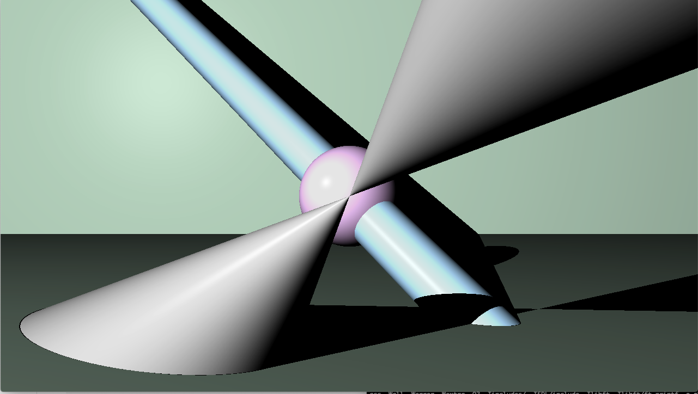
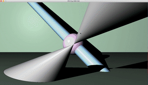

# RT

RT is a graphc project. The goal here is to recreate an entire Ray-Tracer.
We choose the C language but It could be interesting to do it in C++ (especially for vectors and objects)

Short description:
- There is just one scene. We've created a parsor in JSON but it isn't implemented in the project yet.
- You can move and rotate the camera
- You can move and rotate objects
- All objects have the same kind of texture for now

## Getting started

These instructions will get you a copy of the project up and running on your local machine for development and testing purposes.
Be careful to change the prefix in script_sdl if you are not on MAC OS X. 
We've created this project on MAC OS so we can't guaranteed his well-functionning on other kernels.

### Installing
Clone the repository.
Change the path of sdl2-config in script_sdl if you want.

```
PREFIX=~/.brew/
```

Launch make

```
bash> make
```

You should have a SDL Folder and an executable named rtv1.

## Running the tests

First, you have to know that there is only one scene and his description is in the file create_scene_test.c
It will change when we do implement the parsor.

### Example

Launch rtv1

```
./rtv1
```

You should have something like this:<br/>

<br/>

You can do multiple things on the scene:

1) IF NOTHING IS SELECTED

- Move cam with arrows keys
- Rotate the cam with key x/y/z + arrow_up or down
- You can select an object with the mouse

2) IF AN OBJECT IS SELECTED

- Move the object with arrow keys
- Rotate the object with key x/y/z + arrow_up or down (except for the sphere)
- You can select another object with the mouse
- Press space to select the cam

Short demo video <br/>
<br/>

## Authors
* **Martin Siesse** [Msiesse](https://github.com/msiesse)
* **Thomas Bottini** [Tbottini](https://github.com/tbottini)
